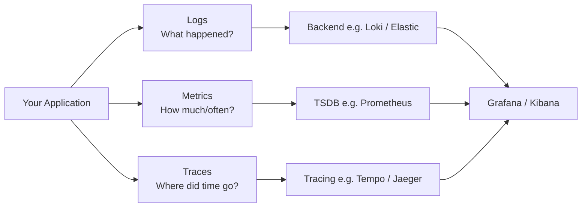
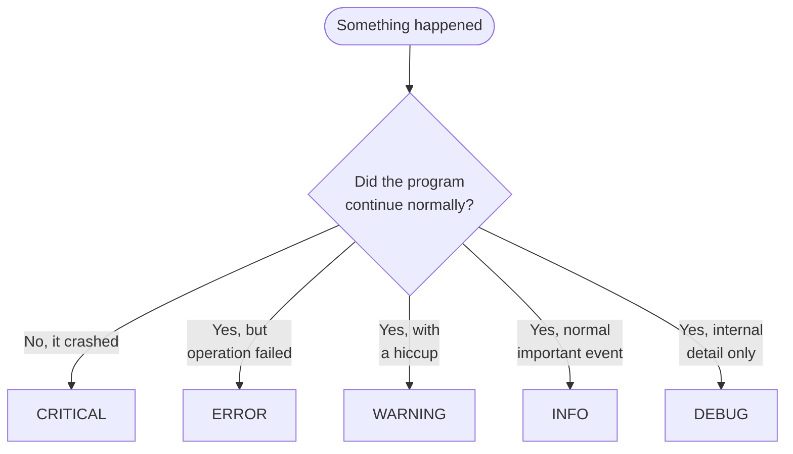
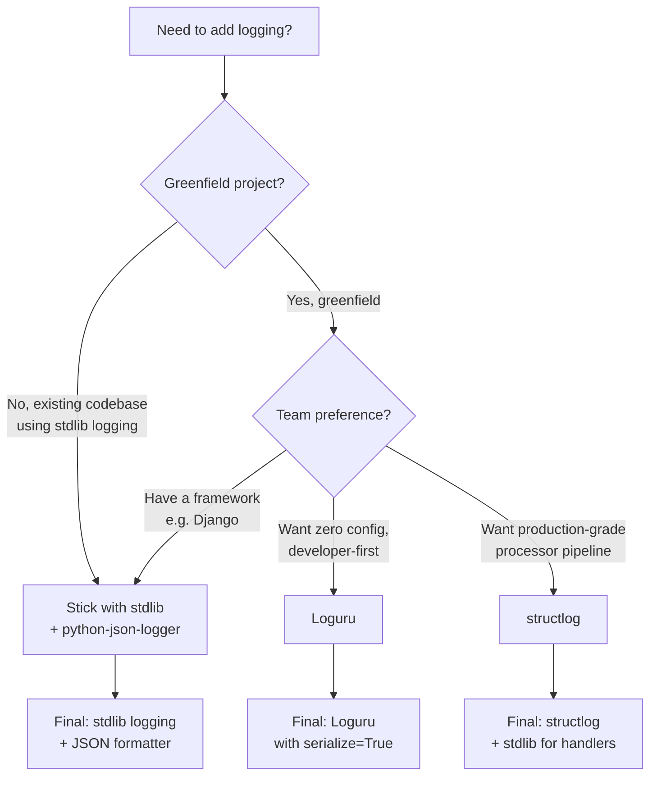
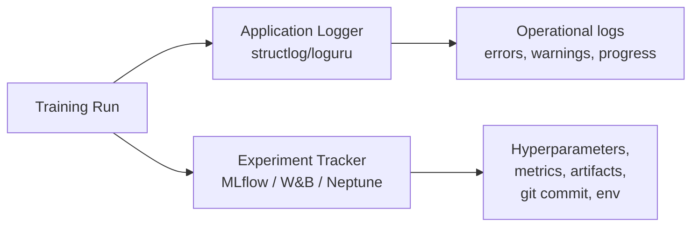
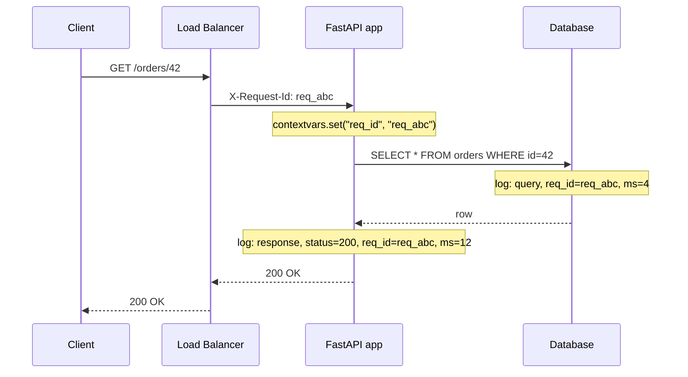
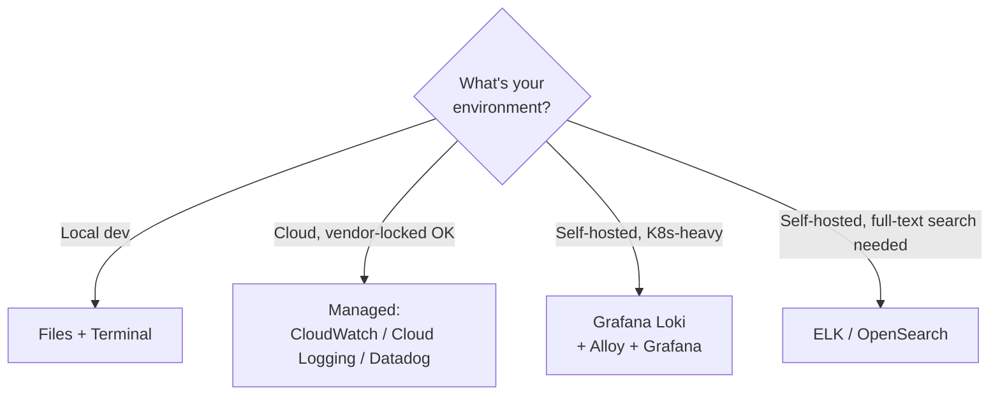
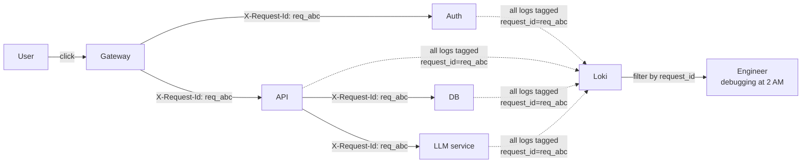

# 📜 The Logging Handbook — From Print Statements to LLMOps Observability

> A practical, opinionated, and production-ready guide to logging across the entire modern data & AI stack: **data pipelines · ML training · ML inference · LLM applications · backend services · DevOps infrastructure.**

[](https://www.python.org/)
[](https://www.structlog.org/)
[](https://github.com/Delgan/loguru)
[](https://mlflow.org/)
[](https://opentelemetry.io/docs/specs/semconv/gen-ai/)
[](https://langfuse.com/)
[](LICENSE)

---

## Why this guide exists

If you've shipped anything to production, you already know the bitter truth:

> When something breaks at 2 AM, the only thing standing between you and a four-hour outage is **whether you logged the right thing, in the right shape, in the right place.**

But the logging landscape is fragmented, outdated, and confusing:

- Tutorials still teach `print()` and `logging.basicConfig()` in 2026.
- Half of the "best practices" articles were written before structured logging existed.
- ML teams log to TensorBoard, backend teams to ELK, DevOps to CloudWatch — and nothing talks to anything.
- LLM applications have an entirely new failure mode (silent semantic failure) that no one taught you to log.

This handbook fixes that. It answers the questions every other guide skips:

1. **When** do I actually need logging vs. metrics vs. tracing?
2. **What level** (DEBUG/INFO/WARN/ERROR/CRITICAL) is correct?
3. **What format** (plain text vs JSON vs key-value) and why?
4. **What library** (stdlib, structlog, Loguru) for which use case?
5. **What to log** in a data pipeline / ML training / LLM call / API request?
6. **Where** to store logs — locally? Loki? ELK? CloudWatch? Langfuse?
7. **How** to correlate logs across services (request IDs, trace IDs, span IDs).

Every concept comes with a runnable example. Every recommendation cites real research from late 2025 / early 2026.

---

## 📚 Table of Contents

- [Quick Start](#-quick-start)
- [The Three Pillars: Logs, Metrics, Traces](#-the-three-pillars-logs-metrics-traces)
- [Log Levels — A Decision Guide](#-log-levels--a-decision-guide)
- [Structured vs Unstructured Logging](#-structured-vs-unstructured-logging)
- [Python Logging Libraries Compared](#-python-logging-libraries-compared)
- [Logging by Domain](#-logging-by-domain)
  - [1. Data Pipelines](#1-data-pipelines)
  - [2. ML Training](#2-ml-training)
  - [3. ML Inference & Serving](#3-ml-inference--serving)
  - [4. LLM Applications & LLMOps](#4-llm-applications--llmops)
  - [5. Backend APIs (FastAPI/Flask)](#5-backend-apis-fastapiflask)
  - [6. DevOps & Infrastructure](#6-devops--infrastructure)
- [Where to Store Your Logs](#-where-to-store-your-logs)
- [Correlation: Tying It All Together](#-correlation-tying-it-all-together)
- [The Master Decision Matrix](#-the-master-decision-matrix)
- [Common Pitfalls](#-common-pitfalls)
- [Cheat Sheet](#-cheat-sheet)
- [Project Structure](#-project-structure)
- [Further Reading](#-further-reading)

---

## 🚀 Quick Start

```bash
# 1. Clone the repo
git clone https://github.com/<your-username>/logging-handbook.git
cd logging-handbook

# 2. Create a virtual environment & install
python -m venv .venv && source .venv/bin/activate
pip install -r requirements.txt

# 3. Run any example
python examples/01_logging_basics.py
python examples/02_structured_logging.py
python examples/03_structlog_production.py
# ... etc

# 4. (Optional) Spin up the local log stack — Grafana + Loki
docker compose up -d
# Open Grafana at http://localhost:3000  (admin / admin)
```

Each example file is **self-contained**, runs in seconds, and shows a single concept clearly with labeled output.

---

## 🏛 The Three Pillars: Logs, Metrics, Traces

Modern observability isn't just logging. It's three signals working together:



| Signal | What it answers | Example |
|---|---|---|
| **Logs** | "What discrete event happened?" | `"user_login_failed user_id=42 reason=bad_password"` |
| **Metrics** | "How is the system performing over time?" | `http_requests_total{route="/login"} 12834` |
| **Traces** | "Where did the request go and how long did each hop take?" | A flame graph of a 1.2 s request across 8 services |

**This handbook focuses on logs**, but treats them as a first-class citizen of the broader observability stack — not as text files glued together with `grep`.

---

## 📊 Log Levels — A Decision Guide

Every logging library has the same five levels. Picking the right one is the single most common mistake.



| Level | Use for | Example | Should it page someone? |
|---|---|---|:---:|
| `CRITICAL` | The application cannot continue | DB unreachable; out of disk | ✅ Yes |
| `ERROR` | An operation failed; user-visible bug | API returned 500; job crashed | ✅ Yes |
| `WARNING` | Recoverable issue worth knowing | Retry succeeded after 3 tries; deprecated endpoint hit | 🤔 Maybe |
| `INFO` | Routine business events | "User created order #4521" | ❌ No |
| `DEBUG` | Internals for developers only | Cache hit/miss, intermediate values | ❌ Never in prod |

**Rule of thumb:** if you'd be embarrassed to wake a colleague over it, it's not `ERROR`.

---

## ⚖ Structured vs Unstructured Logging

This is the single most consequential decision in your logging strategy.

### ❌ Unstructured (the old way)

```text
2026-05-15 14:23:01 INFO User 42 logged in from 192.168.1.1 (took 230ms)
2026-05-15 14:23:02 ERROR Failed to charge user 42 for $19.99 — card declined
```

To search "all events for user 42", you write fragile regex. To compute "average login latency", you write more regex. To slice by region, country, plan tier — regex on top of regex.

### ✅ Structured (the modern way)

```json
{"ts": "2026-05-15T14:23:01Z", "level": "info", "event": "user_login",
 "user_id": 42, "ip": "192.168.1.1", "duration_ms": 230}
{"ts": "2026-05-15T14:23:02Z", "level": "error", "event": "charge_failed",
 "user_id": 42, "amount_usd": 19.99, "reason": "card_declined"}
```

Now your logging backend can answer questions like:

- *"What's p99 login latency for users in Germany on the Pro plan today?"*
- *"Show me every failed charge for user 42 in the last 30 days."*
- *"Alert when `charge_failed` rate exceeds 0.5 % over a 5-minute window."*

…without you ever writing a regex.

> 📌 **The takeaway:** in 2026, plain-text logs are a liability. Every example in this repo emits structured (usually JSON) logs.

---

## 🛠 Python Logging Libraries Compared



| Library | Strengths | Weaknesses | Pick if |
|---|---|---|---|
| **stdlib `logging`** | Battle-tested. Every library uses it. Handlers/Filters mature. | Verbose config. Unstructured by default. | You're integrating into an existing codebase or need maximum library compatibility. |
| **`structlog`** | Best-in-class structured logging. Processor pipeline. Plays well with stdlib. OpenTelemetry-friendly. | Steeper learning curve. | You want production-grade, scalable structured logging with explicit control. |
| **`loguru`** | Beautiful API. One-line setup. Built-in JSON, rotation, exception capture. | No official OpenTelemetry integration. Less standard. | You want maximum developer ergonomics on a small/medium project. |
| **`python-json-logger`** | Drop-in stdlib formatter for JSON output. | Just a formatter — not a full library. | You want to JSON-ify existing stdlib logs with minimal change. |

> 💡 **My take, based on 2025–2026 community consensus:** **structlog** for production services, **Loguru** for scripts and prototypes, **stdlib** when you must.

---

## 🎯 Logging by Domain

This is where most guides fall apart. *"What to log"* is wildly different across the stack. Below is the field guide.

### 1. Data Pipelines

**What you must log:**

| Event | Fields to include | Why |
|---|---|---|
| Pipeline start | `pipeline_id`, `run_id`, `git_commit`, `params` | Reproducibility |
| Step start/end | `step_name`, `duration_ms`, `rows_in`, `rows_out` | Bottleneck analysis |
| Data quality check | `check_name`, `result`, `bad_rows`, `total_rows` | Catch silent corruption |
| Schema change | `source`, `old_schema`, `new_schema` | Detect upstream drift |
| Pipeline end | `status`, `duration_ms`, `rows_written` | SLO tracking |

**What NOT to log:** entire dataframes, raw PII, or "the data passed all checks" (log the *result* of each check, not just success).

**Example file:** [`examples/06_data_pipeline_logging.py`](examples/06_data_pipeline_logging.py)

---

### 2. ML Training

ML training has a special status: you should log to **two places**:



- **Application logger (`structlog`/`loguru`)** → operational events (errors, retries, GPU OOMs).
- **Experiment tracker (`MLflow`/`W&B`)** → the *science*: hyperparameters, per-epoch metrics, model artifacts, the git commit & environment.

**The minimum to log for every training run:**

| Category | Fields |
|---|---|
| Identity | `run_id`, `git_commit`, `experiment_name`, `user` |
| Inputs | hyperparameters, random seeds, dataset version/hash |
| Environment | Python version, library versions, GPU model, OS |
| Outputs | metrics per epoch, best metric, final metric |
| Artifacts | model weights, confusion matrix, sample predictions |

**Tooling consensus (late 2025 / early 2026):**

| Tool | Strength |
|---|---|
| **MLflow** | Open-source standard, framework-agnostic, model registry |
| **Weights & Biases** | Best UI, developer-first, dominant in research labs (OpenAI, NVIDIA, etc.) |
| **Neptune** | Best for huge enterprise teams; metadata-store philosophy |

**Example file:** [`examples/07_ml_training_mlflow.py`](examples/07_ml_training_mlflow.py)

---

### 3. ML Inference & Serving

Once your model is serving live traffic, you log **for two audiences**:

- **Engineers**: errors, latency, request rate.
- **Data Scientists**: input distributions, predictions, drift signals.

**What to log per prediction:**

```json
{
  "ts": "2026-05-15T14:23:01Z",
  "request_id": "req_abc123",
  "model_name": "fraud-detection",
  "model_version": "v3.1.2",
  "model_sha": "9a8f7e6...",
  "feature_vector_hash": "5d4c3b2...",
  "prediction": 0.87,
  "predicted_class": "fraud",
  "latency_ms": 12.4,
  "confidence": 0.87
}
```

> ⚠️ **Privacy alert:** never log raw PII. Either hash features or log a feature-vector summary (means, ranges). For drift detection, statistics are usually enough.

**Example file:** [`examples/08_ml_inference_logging.py`](examples/08_ml_inference_logging.py)

---

### 4. LLM Applications & LLMOps

This is the newest, most rapidly evolving area. LLMs **fail silently** — a 200 OK response can still be useless or harmful. You need a different kind of observability.

**The OpenTelemetry GenAI semantic convention** (now natively supported by Datadog, Langfuse, LangSmith, and most observability vendors) is the emerging standard. Always log these attributes on every LLM call:

| Attribute | Example |
|---|---|
| `gen_ai.system` | `"openai"` / `"anthropic"` / `"vertex_ai"` |
| `gen_ai.request.model` | `"gpt-4o"` / `"claude-sonnet-4-5"` |
| `gen_ai.usage.input_tokens` | `1245` |
| `gen_ai.usage.output_tokens` | `387` |
| `gen_ai.response.finish_reason` | `"stop"` / `"length"` / `"tool_calls"` |
| `gen_ai.request.temperature` | `0.7` |
| (optional) `gen_ai.prompt` | the actual prompt (gated by env flag) |
| (optional) `gen_ai.completion` | the actual completion |

**Tooling landscape (late 2025 / early 2026):**

| Tool | License | Best for | Notes |
|---|---|---|---|
| **Langfuse** | MIT (open source) | Self-hosted, framework-agnostic | 19k+ ⭐, ClickHouse-backed |
| **LangSmith** | Proprietary SaaS | LangChain/LangGraph teams | Tightest LangChain integration |
| **Arize Phoenix** | Apache 2.0 | RAG, embedding visualization | Strong eval tooling |
| **OpenLLMetry** | Open source | Vendor-neutral instrumentation | Pure OTel SDK |
| **Helicone** | Open source | Proxy-based, 2-min setup | Lowest friction |
| **W&B Weave** | Proprietary | Teams already on W&B | Good if you have W&B for ML |
| **Datadog LLM Obs** | Commercial | Existing Datadog shops | Native OTel GenAI support |

**Example files:**
- [`examples/09_llm_basic_logging.py`](examples/09_llm_basic_logging.py) — provider-agnostic structured logging
- [`examples/10_llm_opentelemetry.py`](examples/10_llm_opentelemetry.py) — OpenTelemetry GenAI conventions
- [`examples/11_langfuse_integration.py`](examples/11_langfuse_integration.py) — Langfuse traces

---

### 5. Backend APIs (FastAPI/Flask)

**The non-negotiables:**

1. **Generate a request ID at the edge** (or use the `X-Request-Id` header from the load balancer).
2. **Bind it to every log line** for that request via `contextvars`.
3. **Log request received + response sent** with method, path, status, duration.
4. **Never log secrets, tokens, or full request bodies** containing PII.



**Example file:** [`examples/12_fastapi_logging.py`](examples/12_fastapi_logging.py)

---

### 6. DevOps & Infrastructure

**The 12-Factor App principle:** treat logs as event streams. Don't manage rotation, files, or destinations *inside your application*. Write to `stdout`/`stderr` and let the platform handle the rest.

| Environment | Where to ship logs |
|---|---|
| **Local dev** | Terminal (pretty-printed) |
| **Docker** | `stdout` → captured by Docker daemon |
| **Kubernetes** | `stdout` → captured by `kubelet` → forwarded by Fluent Bit / Vector / Alloy |
| **AWS Lambda** | `stdout` → CloudWatch Logs |
| **Cloud Run / App Engine** | `stdout` → Cloud Logging |

**Never** roll your own file rotation in containerized environments. It's an anti-pattern in 2026.

**Log shippers (the agents that move logs):**

| Agent | Notes |
|---|---|
| **Grafana Alloy** | OTel-native, replaces Promtail. Recommended for new deployments. |
| **Fluent Bit** | Lightweight, ubiquitous in Kubernetes. |
| **Vector** | Rust-based, transforms logs in-flight. |
| **Filebeat** | Classic ELK companion. |

---

## 💾 Where to Store Your Logs

You have four broad choices. Pick based on volume, budget, and existing stack.



### Comparison: the four common stacks

| Stack | License | Storage cost | Query power | Best for | Watch out for |
|---|---|---|---|---|---|
| **Grafana Loki + Promtail/Alloy** | AGPL | 💰 Low (indexes labels, not content) | Medium (LogQL, label-based) | Cloud-native, Kubernetes, high-volume | Avoid high-cardinality labels |
| **ELK / OpenSearch** | Apache 2.0 (OpenSearch) / Elastic License | 💰💰💰 High (full-text index) | High (powerful search & aggs) | Compliance, security, full-text needs | Operational overhead |
| **Cloud-managed** (CloudWatch / Stackdriver / Azure Monitor) | Commercial | 💰💰 Pay-per-GB | Medium | Teams already on that cloud | Vendor lock-in, costs scale fast |
| **SaaS** (Datadog / New Relic / Better Stack) | Commercial | 💰💰💰 Premium | High + alerting included | Teams wanting zero ops burden | Bill shock at scale |

### My opinionated recommendations

| Situation | Recommendation |
|---|---|
| Small/medium self-hosted project | **Loki + Grafana** via Docker Compose (this repo has it!) |
| Kubernetes + open-source | **Loki + Alloy + Grafana** |
| Enterprise, compliance-heavy | **OpenSearch (ELK)** or **Datadog** |
| LLM-specific traces only | **Langfuse** (self-hosted) or **LangSmith** (managed) |
| ML experiment metrics | **MLflow** (open) or **W&B** (managed) |

This repo ships with a [`docker-compose.yml`](docker-compose.yml) that spins up the Loki + Grafana stack so you can try structured logs end-to-end locally.

---

## 🔗 Correlation: Tying It All Together

In a distributed system, a single user click might touch 8 services. If each writes 4 log lines, you have **32 unrelated log entries** unless you correlate them.



**Two correlation IDs you need:**

1. **`request_id`** — generated at the edge (or use `X-Request-Id` from your LB). Bind to `contextvars` and include on every log line.
2. **`trace_id` / `span_id`** — if you're using OpenTelemetry, structlog can auto-inject these. This links logs to distributed traces.

> 📌 **Rule:** if you cannot reconstruct the full story of one request from a single query, your correlation is broken.

**Example file:** [`examples/05_correlation_ids.py`](examples/05_correlation_ids.py)

---

## 📋 The Master Decision Matrix

| Domain | Library | Format | Where to ship | Special tools |
|---|---|---|---|---|
| Data pipelines | structlog | JSON | Loki / ELK | Great Expectations for data-quality events |
| ML training | structlog + MLflow | JSON + MLflow runs | Loki/ELK + MLflow Tracking | MLflow, W&B, Neptune |
| ML inference | structlog | JSON | Loki / ELK + drift store | Evidently, Arize, WhyLabs |
| LLM apps | structlog + OTel GenAI | JSON + OTLP traces | Langfuse / LangSmith / Phoenix | Langfuse, LangSmith, OpenLLMetry |
| FastAPI/Flask | structlog | JSON | Loki / ELK / Datadog | OpenTelemetry middleware |
| Background jobs | structlog | JSON | Loki / ELK | Correlation via job_id |
| Containers/K8s | stdout | JSON | Fluent Bit / Alloy → Loki | OpenTelemetry Collector |
| Lambda / FaaS | stdout (print or logger) | JSON | CloudWatch / Cloud Logging | Powertools for AWS Lambda |

---

## ⚠ Common Pitfalls

> **Pitfall 1: Using `print()` in production code.**
> `print()` can't be filtered by level, can't be sent to multiple sinks, and can't be silenced from outside the module. Replace every `print` with a logger.

> **Pitfall 2: Logging secrets.**
> Tokens, API keys, full credit-card numbers, JWTs, full user objects with passwords. Use a redaction processor in structlog/Loguru or scrub via your log shipper (Fluent Bit has filters for this).

> **Pitfall 3: Logging the entire request body.**
> A 5 MB upload becomes a 5 MB log line. Log a summary: size, content-type, first 200 chars max.

> **Pitfall 4: `f"User {user_id} logged in"` instead of structured fields.**
> Stuffing variables into f-strings makes them unsearchable. Use `logger.info("user_login", user_id=user_id)`.

> **Pitfall 5: No correlation ID across services.**
> One user request = one ID, threaded through every service. Without it, distributed debugging is impossible.

> **Pitfall 6: Logging at DEBUG in production.**
> DEBUG logs are for developers locally. In prod they bloat storage and slow your service. Default to INFO; flip to DEBUG only when needed.

> **Pitfall 7: Not configuring root logger.**
> Library logs (urllib3, boto3, sqlalchemy) often spam at DEBUG/INFO. Set their levels explicitly.

> **Pitfall 8: Building file rotation into a containerized app.**
> In containers, log to stdout. Let the platform handle rotation, retention, and shipping. Rolling files inside a container is a 2010s anti-pattern.

> **Pitfall 9: Treating logs as the only signal.**
> Logs are for *events*. Use **metrics** for rates/percentiles and **traces** for request flow. Don't try to count things by parsing logs.

> **Pitfall 10: Ignoring high-cardinality fields in Loki.**
> Loki indexes labels, not content. Putting `user_id` as a *label* (instead of in the log body) destroys performance.

---

## 🃏 Cheat Sheet

```text
╭─────────────────────────────────────────────────────────────╮
│  CHOOSING A LIBRARY                                          │
│  ─────────────────────────────────────────────────────       │
│  Production service, structured logs   →  structlog          │
│  Quick script or prototype             →  loguru             │
│  Existing codebase, Django, etc.       →  stdlib + JSON fmt  │
╰─────────────────────────────────────────────────────────────╯

╭─────────────────────────────────────────────────────────────╮
│  CHOOSING A LEVEL                                            │
│  ─────────────────────────────────────────────────────       │
│  Page someone right now?               →  CRITICAL / ERROR   │
│  Worth knowing, but not a fire?        →  WARNING            │
│  Routine business event                →  INFO               │
│  Internal detail, devs only            →  DEBUG              │
╰─────────────────────────────────────────────────────────────╯

╭─────────────────────────────────────────────────────────────╮
│  CHOOSING A BACKEND                                          │
│  ─────────────────────────────────────────────────────       │
│  Self-host, cloud-native, cheap        →  Loki + Grafana     │
│  Full-text + compliance                →  OpenSearch (ELK)   │
│  Zero ops, big budget                  →  Datadog / NewRelic │
│  LLM traces specifically               →  Langfuse / LSmith  │
│  ML experiment metrics                 →  MLflow / W&B       │
╰─────────────────────────────────────────────────────────────╯

╭─────────────────────────────────────────────────────────────╮
│  THE 6 RULES                                                 │
│  ─────────────────────────────────────────────────────       │
│  1. Always use structured (JSON) logs                        │
│  2. Always include a correlation ID                          │
│  3. Never log secrets or PII                                 │
│  4. Log to stdout in containers (12-factor)                  │
│  5. Pick the right level (don't ERROR-spam)                  │
│  6. For LLMs, follow OTel GenAI conventions                  │
╰─────────────────────────────────────────────────────────────╯
```

---

## 📁 Project Structure

```
logging-handbook/
├── README.md                          ← you are here
├── PROGRESS.md                        ← project build progress
├── requirements.txt
├── docker-compose.yml                 ← local Loki + Grafana stack
├── configs/
│   ├── loki-config.yml
│   ├── alloy-config.alloy
│   └── grafana-datasources.yml
└── examples/
    ├── 01_logging_basics.py           ← stdlib logging done right
    ├── 02_structured_logging.py       ← JSON output with python-json-logger
    ├── 03_structlog_production.py     ← structlog for production
    ├── 04_loguru_quickstart.py        ← loguru: zero-config alternative
    ├── 05_correlation_ids.py          ← request IDs via contextvars
    ├── 06_data_pipeline_logging.py    ← pipeline status & data quality
    ├── 07_ml_training_mlflow.py       ← MLflow experiment tracking
    ├── 08_ml_inference_logging.py     ← serving logs + drift signals
    ├── 09_llm_basic_logging.py        ← LLM call structured logging
    ├── 10_llm_opentelemetry.py        ← OTel GenAI conventions
    ├── 11_langfuse_integration.py     ← Langfuse traces for LLM apps
    └── 12_fastapi_logging.py          ← request/response middleware
```

---

## 📖 Further Reading

**Specifications:**
- [OpenTelemetry GenAI Semantic Conventions](https://opentelemetry.io/docs/specs/semconv/gen-ai/)
- [The Twelve-Factor App — Logs](https://12factor.net/logs)

**Books:**
- *Observability Engineering* — Charity Majors, Liz Fong-Jones, George Miranda
- *Site Reliability Engineering* — Google SRE Book (free online)

**Libraries:**
- [structlog](https://www.structlog.org/) · [Loguru](https://loguru.readthedocs.io/) · [python-json-logger](https://github.com/madzak/python-json-logger)
- [MLflow](https://mlflow.org/) · [Weights & Biases](https://wandb.ai/) · [Neptune](https://neptune.ai/)
- [Langfuse](https://langfuse.com/) · [LangSmith](https://smith.langchain.com/) · [Phoenix](https://phoenix.arize.com/) · [OpenLLMetry](https://www.traceloop.com/openllmetry)

**Storage:**
- [Grafana Loki](https://grafana.com/oss/loki/) · [OpenSearch](https://opensearch.org/) · [SigNoz](https://signoz.io/)

---

## 📝 The Golden Rule

> **Logs are not strings you grep — they are structured events you query.**
>
> Adopt this mindset, and every example in this repo will feel obvious.
> Resist it, and you'll be writing regex at 2 AM forever.

Happy logging. 🚀

━━━━━━━━━━━━━━━━━━━━
💾 AUTO-SAVED:
- README.md

✅ COMPLETED: Comprehensive README with all sections, diagrams, tables, and cheat sheets

▶️  NEXT TASK: Create requirements.txt + PROGRESS.md
━━━━━━━━━━━━━━━━━━━━
